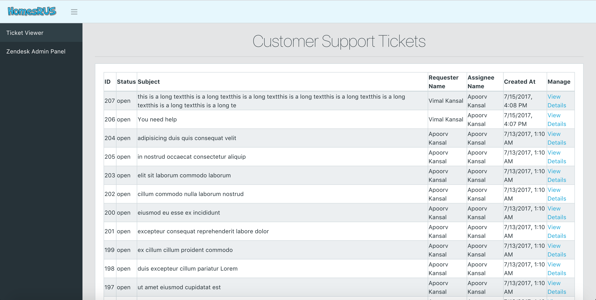

# Zendesk Internship Coding Challenge 2017

## Installation and Usage

Requirements: <br>
- `git`
- `python3+`, `pip`
- `virtualenv` - `pip install virtualenv`
- `node` - [install here](https://nodejs.org/en/)
- `npm` - (should be installed with `node`)
- `angular-cli` - `npm install -g @angular/cli`


**STEP ONE - Setting Up Virtual Environment**

Open up your terminal and go into an empty directory of choice. Run the command below to create a virtual environment:
```
virtualenv -p python3 ZendeskEnv
```

From here, run the two commands below to activate the newly created virtual environment:
```
cd ZendeskEnv
source bin/activate
```

The virtual environment has now been activated and all dependencies will be installed inside here.

**Note**: You exit the virtual environment by using the `deactivate` command.

**STEP TWO - Import Project Source Code**

Now that we have the virtual environment activated, run the command below to load the project:
```
git clone https://github.com/akan57/ZendeskCodeChallenge.git
```

**STEP THREE - Install Backend Packages**
Run the command below to locate the backend dependencies file `requirements.txt`:
```
cd ZendeskCodeChallenge/ZTicketViewerBackEnd
```

There should be a file called `requirements.txt` here. Run the command below to install the Python dependency packages within the virtual environment:
```
pip install -r requirements.txt
```

The backend has all the packages it needs in order to run now.

**STEP FOUR - Run Backend Server**

Now that we have the Python packages installed, run the two commands below to actually run the backend server:
```
cd zticket_viewer_web_project
python manage.py runserver localhost:8080
```
**Note**: Please have port 8080 free to use otherwise you will need to use a different port and then manually change the request endpoints in the Angular 4 frontend side.

**STEP FIVE - Install Frontend Packages**

Leaving the first terminal running the backend server as it is, open a new terminal and locate your `ZendeskEnv` directory. Stay inside this directory (eg. /your_computer_directory/ZendeskEnv/) Run the two commands below to install the frontend dependencies:
```
cd ZendeskCodeChallenge/ZTicketViewerFrontEnd/ticket_viewer_client_app/
npm install
```
This will install all the dependencies needed in the frontend by inspecting the `package.json` file.

**STEP SIX - Run the Frontend Server**

Run the command below to run the local frontend server which serves the Angular 4 application:
```
ng serve --port 4200
```
**Note:** Please have the port 4200 free otherwise you will need to change the port and then change the CORS setting inside `/ZendeskEnv/ZendeskCodeChallenge/ZZTicketViewerBackEnd/
zticket_viewer_web_project/zticket_viewer_web_project/
settings.py` where you will need to change this code below:
```
CORS_ORIGIN_WHITELIST = (
    'localhost:4200'
)
```
to
```
CORS_ORIGIN_WHITELIST = (
    'localhost:<YOUR NEW PORT>'
)
```

**(MISCELLANEOUS) STEP SEVEN - Running Unit Tests**

In order to run the unit tests, open a new terminal and locate your `ZendeskEnv` directory. Stay inside this directory (eg. /your_computer_directory/ZendeskEnv/). Run the commands below to run all unit tests:
```
source bin/activate
cd ZendeskCodeChallenge/ZTicketViewerBackEnd/zticket_viewer_web_project/
python manage.py test
```

The test code are located in these two locations:
- `ZendeskEnv/ZendeskCodeChallenge/ZTicketViewerBackEnd/
zticket_viewer_web_project/z_api/tests/`
- `ZendeskEnv/ZendeskCodeChallenge/ZTicketViewerBackEnd/
zticket_viewer_web_project/zticket_viewer_web_app/tests/`


## Summary
This coding challenge required us to create a program that allows employees of a business (particularly customer support employees) to view their customer enquiries and needs via Zendesk tickets. This meant that the program had to communicate with the Zendesk api in order to display
bulk and specific ticket details.



## Architectural Design
I created a backend REST API that communicates directly with the Zendesk API. From here, I created a web client application using Angular 4 that directly communicates with my REST api. The main advantage of this design is that in future, we can incorporate many different client applications in different environments (eg. GUI applications). The REST API supports JSON data interchange format which is very ideal as this format is well documented, human readable and very popular amongst millions of developers.


### Stack and Tools used
*Backend:*
- [django](https://www.djangoproject.com/) - used to create the web application.
- [django REST](http://www.django-rest-framework.org/) - used to actually build a REST API so clients can communicate with the service. This works on top of django.
- [requests](http://docs.python-requests.org/en/master/) - used to directly communicate with the Zendesk API.

*Frontend:*
- [Angular 4](https://angular.io/) - used to communicate with my REST api and also manage the client's frontend.
- [CoreUI-Free-Bootstrap-Admin-Template](https://github.com/mrholek/CoreUI-Free-Bootstrap-Admin-Template) - used for frontend design template.
- [jQuery](https://jquery.com/) - used for frontend design.
- [Bootstrap 4](https://v4-alpha.getbootstrap.com/) - used for frontend design.
- [Fontawesome](http://fontawesome.io/) - used for frontend design.
- [angular2-prettyjson](https://www.npmjs.com/package/angular2-prettyjson) - used to format json data on page.

## Backend API Design
The `z_api` python package is a simple Zendesk Python API client. This package was designed to
act as an interface between the Zendesk API and the users (in this case it was my REST API) who want to communicate with the Zendesk API. This form of abstraction has allowed my REST API to focus on performing actions on Zendesk resources without being concerned about the actual implementation to make requests, process JSON data and work with many more lower level details. Another advantage of separating the REST
API from the implementation of making requests and directly communicating with Zendesk API through an abstracted layer (`z_api`) is that the `z_api` package can be plugged into another environment such as a GUI application.

Essentially, the design starts off with a general class, `ZResource`, which represents any resource in the Zendesk API. From here, we subclass `ZResource` for every resource found in Zendesk's [documentation](https://developer.zendesk.com/rest_api/docs/core/introduction). In each subclass, there will be
certain actions (which would be methods) that can be performed on the resource which would ideally support anything that is outlined in Zendesk's documentation. Due to the scope of this coding challenge, the API client has only been coded to meet the current functional requirements. However if extra functionality is required, the API can be easily extended. Please see `ZTicketViewerBackend/design/zendesk_api_design.pdf` for more details.
